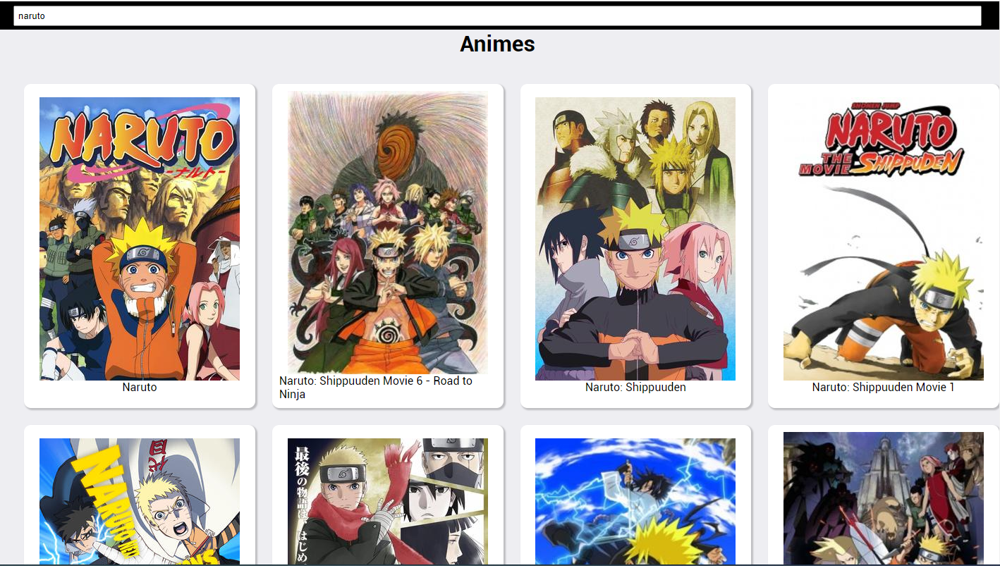

# Atividade 2

Atividade proposta na segunda aula ministrada por Vinicius Dacal, na Pós-Graduação da UniALFA Umuarama de Desenvolvimento de Aplicações para Internet e Dispositivos Móveis, que consiste na comunicação com uma API externa e listagem desses dados no React js. A API utilizada foi a [Kitsu API](https://kitsu.docs.apiary.io/) que retorna uma lista de animes conforme o que foi digitado no campo de pesquisa.

<h1 align="center">
  
</h1>
